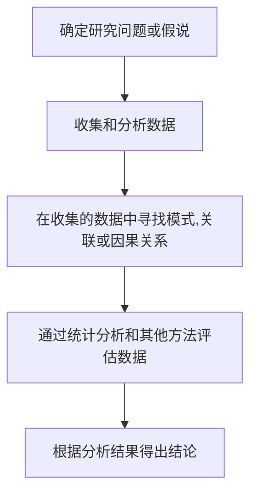
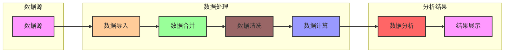
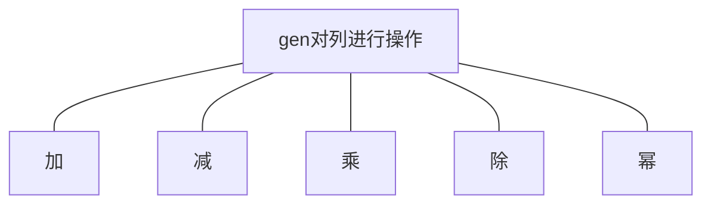
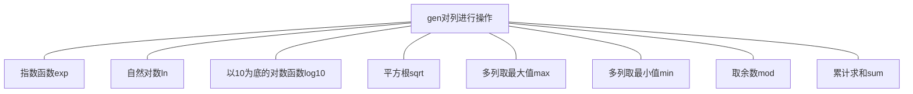
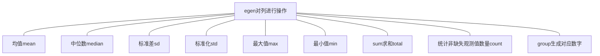
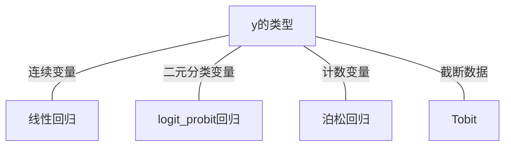
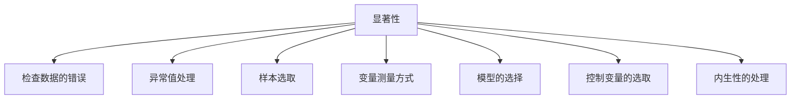
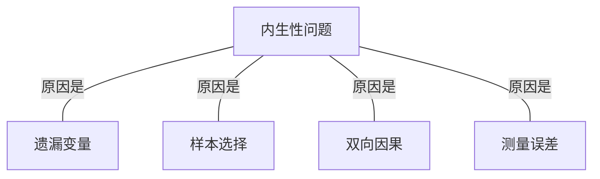
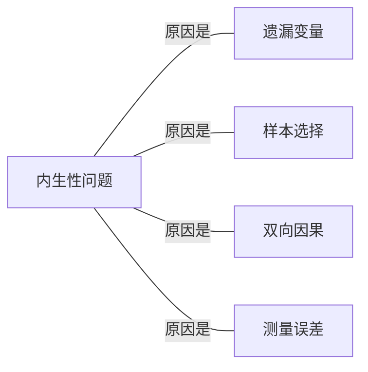
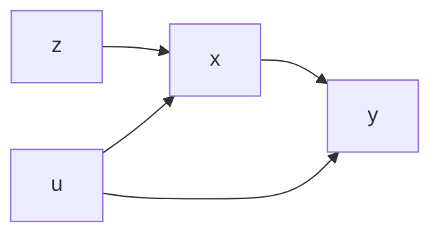

# 第1讲 引言

##  实证研究概述

### 什么是实证研究？

实证研究是指通过实证方法收集和分析可观察现象和数据，以验证或否定某种理论、假设或假说的科学研究方法。实证研究旨在通过实证数据来支持或推翻各种理论、模型或假设，并从中获得新的知识或见解。

实证研究通常包括以下步骤：




### 基本思想

实证研究的基本思想是通过收集、分析和解释客观的实证数据，验证或推翻某种理论或假说。

##  实际的例子

- 提出假设

>本文认为，信息不对称和代理冲突等问题使得许多企业内部薪酬结构不断偏离合理水平，并引发了高管与普通员工之间的超额薪酬差距1问题，加剧企业内部收入分配不平等。作为一种重要的外部监督治理机制，税收征管对企业发挥了显著的公司治理作用（曾亚敏和张俊生，2009）。在积极推进智慧税务建设的背景下，税收征管数字化建设能够进一步发挥数据要素的驱动作用，实现税务监管模式的变革，强化税收征管工作的监督作用，从而缓解信息不对称和代理冲突等问题引发的高管超额薪酬问题，最终有助于间接推动企业薪酬体系的完善。因此，本文预期，税收征管数字化能够有效地发挥公司治理作用从而抑制高管超额薪酬，使得企业内部薪酬差距更趋合理。
>
>基于上述分析，本文提出：
>
>假说1：税收征管数字化会显著缩小企业内部高管与普通员工之间的薪酬差距。

- 研究设计

>为了检验前文的研究假说，本文利用金税三期工程的准自然实验，采用变时点DID的估计方法，识别税收征管数字化对企业内部薪酬差距的影响。具体实证模型构建如下：
>
>$$\begin{matrix}gap_{it}=&\alpha_{0}+\alpha_{1}gtp_{ct}+\alpha_{2}CV+\delta_{i}+\mu_{j}+\gamma_{c}+\theta_{t}+\varepsilon_{it}\end{matrix}$$
>
>其中，gap代表企业内部薪酬差距。下标i、j、c、t分别表示企业、行业、省份、年份。gtp代表企业所在地区当年进行了金税三期工程试点，用于测度税收征管数字化，其系数α1表示税收征管数字化对企业内部薪酬差距的影响。CV代表控制变量集合。本文控制了省份固定效应（γc）、行业固定效应（μj）和企业固定效应（δi），以控制地区层面、行业层面和企业层面不随时间变化因素对实证结果的影响；还控制了年份固定效应（θt），以控制随时间变化因素对企业内部薪酬差距的影响。同时，本文在公司层面上聚类调整标准误。

## 研究方法的选择

- 案例研究
- QCA分析法
- 元分析
- 实验研究……

**研究方法与研究内容的匹配**


##  Stata概述、菜单操作

### Stata 基础介绍

#### 什么是Stata

Stata是一种**统计软件**，主要用于统计分析和绘图。它提供了一种广泛使用的、集成的环境，可以在一个界面中完成数据的读入、数据清理、数据分析和数据可视化等工作。Stata广泛应用于在**经济学**和政治学等社会科学领域中得到广泛使用。

#### Stata有何优势

- 适用于**大规模数据分析**：与Excel相比，Stata能够更好地处理大型数据集（速度快、稳定性高）

- **统计分析**功能强大：固定效应模型,DID。

- 可编程性：Stata具有高度的可编程性

#### 为什么用Stata？

- 强大的数据管理功能；全面的统计分析功能；稳定的计算引擎；丰富的绘图功能；开放性和可扩展性
- 权威性：很多文献都用
- 学习材料：方便学习


### Stata软件介绍

#### 安装

- Stata软件的安装和注册通常很简单，只需根据Stata官网的指示进行即可。
  - 付费软件；学校正规渠道购买

#### 界面构成

- 命令窗口(Command window): 可以在这里输入命令进行数据操作和统计分析。
- 变量查看窗口(Variables window): 显示当前数据集中所有变量的名称和类型。
- 数据浏览窗口(Data browser window): 显示当前数据集的前几行和最后几行数据。
- 输出窗口(Output window): 显示数据操作和统计分析的结果。
- 统计分析菜单(Statistics menu): 包含常用的统计分析命令和选项。
- 工具栏(Toolbar): 提供快捷的数据操作和统计分析功能。

#### PS：如何设置中文

- 设置中文;Stata15之后能够使用中文【编辑-->首选项-->用户界面语言】

#### 学习

- 从2到N：用特殊的情况理解原理，再在论文实证中做大范围

### 数据简介

#### 认识数据：数据的基本类型

Stata 常用的数据类型主要有三类：

- 数值（数字）

```stata
help datatype
```

- 字符（文本格式）
  - 字符串（string） **str** 
  - "我是silencedream"  “平安银行” 等都能。 注意 ： ”123“
- 日期
  - 两个日期之间的天数  2023 -05 -13


#### 数据结构

**行**表示样本；**列**表示变量【特征】

|      | 姓名 | score1 | score2 |
| ---- | ---- | ------ | ------ |
| 1    | A    | 11     | 11     |
| 2    | B    | 22     | 22     |
| 3    | C    | 33     | 33     |

## Stata命令与帮助文件

### Stata语法介绍

- 语法：交流的规则

- 学一门新的语言：做一个翻译
  - 加总两列数据【score1】【score2】
  - generate score3 = score1 + score2

- ChatGPT
  - 1 + 1 = 2

##  常见的学习资料

### help命令（帮助文档）

- 完整性：官方文档包含了Stata软件中的所有命令和函数
- 及时性：Stata的官方文档会及时更新
- 规范性：Stata的官方文档采用了一致的格式和规范

```stata
help drop
```

### 常见学习资料

- stata官网：https://www.stata.com/
- 连享会 ：https://lianxh.cn/
- 经管之家： https://bbs.pinggu.org/ 
- 中国工业经济： http://ciejournal.ajcass.org/


 

#  Stata程序与编程

##  do文件创建与优化

### dofile

包含Stata命令的文本文件，可以通过运行它来自动执行一系列命令。

- 可以方便地记录和保存数据分析的过程和结果，避免手动操作的失误。

- 可以自动化地重复分析过程，节省时间和减少错误。

- 可以通过修改和编辑do-file来更新和改进分析过程，提高效率和准确性。

- 可以与他人共享和交流分析过程，促进协作和提高透明度。

### 在dofile里多写注释

1. 提高代码的可读性：（对他人而言）良好的注释可以让其他人更快地理解你的代码，提高合作效率。
2. 方便代码的维护和修改：（对自己而言）理解自己写的代码（有可能中途打断）。
3. 提高代码的可复制性：通过注释记录下每一步操作和思路，可以让其他人更容易复制你的代码并在其自己的数据集上运行，从而保证数据分析的可复制性。

- 整行注释

```stata
*  希望你能学好stata
// 希望你能学好stata
```

- 行末注释
```stata
sysuse auto,clear // 调用自带数据
reg price rep78 weight  //进行线性回归分析
```

- 多行注释

```stata
/*sysuse auto,clear
reg price rep78 weight  进行回归分析 */
```


## 2.2 局域暂元与全局暂元

## Global与Local


在Stata中，global和local都是用来创建和使用宏变量的命令。宏变量是可以存储数据或命令，并在程序的不同部分使用的一种特殊类型的变量。它们非常有用，可以帮助减少代码的冗余并提高代码的可读性和可维护性。

- Global变量

使用global命令可以创建全局宏变量，它们可以在Stata会话的所有部分使用。

- Local变量

使用local命令可以创建局部宏变量，它们只在当前程序中使用。

```stata
global control_1 "13344"
display $control_1

local control_2 "1234"
display `control_2'


*[1]虞义华,赵奇锋,鞠晓生.发明家高管与企业创新[J].中国工业经济,2018,No.360(03):136-154.
global firmcontrol "L1.ln_assets L1.ln_firmage L1.ln_fixedpp L1.ln_salespp L1.leverage L1.cashassets_ratio L1.MB_ratio L1.salesgrowth L1.ROA L1.stockreturn L1.stockvolatility L1.herfindahl L1.herfindahl_sq"
xtivreg2 ln_patentdes_grant  $firmcontrol  ///
  (L1.preceo_inventor = L2.pre_homelandpp preceo_inventor) ///
  , fe first
```


## Stata条件语句

在 Stata 中，条件语句用于根据某个条件执行不同的操作。Stata 提供了几种条件语句的类型，包括 `if`、`else`、`elseif` 和 `while`。

1. `if` 语句：`if` 语句用于执行基于某个条件的操作。语法如下：

```
stataCopy codeif condition {
    commands
}
```

其中，`condition` 是一个逻辑条件，如果条件成立，则执行 `commands` 中的操作。

例如，下面的代码根据变量 `x` 的值是否大于 0，执行不同的操作：

```
stataCopy codeif x > 0 {
    display "x is positive"
}
```

1. `else` 语句：`else` 语句用于在条件不满足时执行备选操作。语法如下：

```
stataCopy codeif condition {
    commands
}
else {
    commands
}
```

如果 `condition` 成立，则执行第一组 `commands`；否则，执行第二组 `commands`。

例如，下面的代码根据变量 `x` 的值是否大于 0，输出不同的消息：

```
stataCopy codeif x > 0 {
    display "x is positive"
}
else {
    display "x is non-positive"
}
```

1. `elseif` 语句：`elseif` 语句用于在多个条件之间进行选择。可以使用多个 `elseif` 来测试多个条件，但只有满足第一个条件的分支将被执行。语法如下：

```
stataCopy codeif condition1 {
    commands
}
elseif condition2 {
    commands
}
else {
    commands
}
```

如果 `condition1` 成立，则执行第一组 `commands`；否则，如果 `condition2` 成立，则执行第二组 `commands`；否则，执行最后一组 `commands`。

例如，下面的代码根据变量 `x` 的值输出不同的消息：

```
stataCopy codeif x > 0 {
    display "x is positive"
}
elseif x < 0 {
    display "x is negative"
}
else {
    display "x is zero"
}
```

1. `while` 语句：`while` 语句用于在条件成立时重复执行一组命令。语法如下：

```
stataCopy codewhile condition {
    commands
}
```

只要 `condition` 成立，就会重复执行 `commands` 中的操作。

例如，下面的代码计算变量 `x` 的阶乘：

```
stataCopy codelocal result = 1
local i = 1

while `i' <= `x' {
    local result = `result' * `i'
    local i = `i' + 1
}

display "Factorial of x: " `result'
```

这些是 Stata 中条件语句的基本用法。根据具体的需求，你可以使用这些语句来实现复杂的条件逻辑和控制流程。


## 2.4 Stata循环语句

在 Stata 中，循环语句用于重复执行一组命令，以便在数据集中进行迭代或执行其他重复性任务。Stata 提供了几种类型的循环语句，包括 `forvalues`、`foreach` 和 `while`。

1. `forvalues` 循环：`forvalues` 循环用于按照指定的数值范围进行迭代。语法如下：
```stata
forvalues varname = startval to endval {
    commands
}
```
其中，`varname` 是一个临时变量名称，用于表示当前循环的迭代值；`startval` 是迭代的起始值；`endval` 是迭代的结束值（包括在范围内）。在每次迭代时，`varname` 的值将自动更新，并执行相应的命令。

例如，下面的代码计算变量 `x` 的平方并显示结果：
```stata
forvalues i = 1 to 10 {
    local sq = `i' * `i'
    display "`i' squared is: " `sq'
}
```

2. `foreach` 循环：`foreach` 循环用于按照指定的元素列表进行迭代。语法如下：
```stata
foreach varname of varlist {
    commands
}
```
其中，`varname` 是一个临时变量名称，用于表示当前循环的迭代元素；`varlist` 是一个变量列表或变量名称模式，指定要迭代的元素。在每次迭代时，`varname` 的值将自动更新，并执行相应的命令。

例如，下面的代码将对变量列表 `var1 var2 var3` 中的每个变量执行一些操作：
```stata
foreach var of varlist var1 var2 var3 {
    summarize `var'
}
```

3. `while` 循环：`while` 循环用于在条件成立时重复执行一组命令。语法如下：
```stata
while condition {
    commands
}
```
只要 `condition` 成立，就会重复执行 `commands` 中的操作。在每次迭代之后，应更新 `condition` 的值，以避免无限循环。

例如，下面的代码计算变量 `x` 的阶乘：
```stata
local result = 1
local i = 1

while `i' <= `x' {
    local result = `result' * `i'
    local i = `i' + 1
}

display "Factorial of x: " `result'
```

这些是 Stata 中循环语句的基本用法。通过使用循环语句，你可以自动化执行重复性任务，并对数据集中的每个观测值或变量执行相同的操作。根据具体的需求，你可以使用这些循环语句来实现更复杂的迭代逻辑。


 

# 第3讲 数据管理与可视化**

## 数据处理流程大纲



- 数据收集：数据来源
- 数据导入：如何将收集到的不同格式数据导入stata进行处理( import / use  / export / save)
- 数据合并：如果数据来源于不同的数据库，则需要合并数据 (merge / append)
- 数据清洗
  - 去掉重复值与观测数据  (duplicates )
  - 保留样本 ( keep / drop )
  - 计算变量  (gen / egen / bysort)
  - 数据变量和标签 ( label )
  - 缩尾截尾 ( winsor2)
  - global local 
- 数据分析
  - 描述、相关性统计分析（summarize, pwcorr）
  - 回归分析 (regression, logit\probit, poisson, tobit)
  - 内生性处理 ()

- 结果解释和报告
  - 导出结果(sum2docx , corr2docx, reg2docx)

## 变量转换

### 变量类型

### 认识数据：数据的基本类型

Stata 常用的数据类型主要有三类：

- 数值（数字）

```stata
help datatype
```

- 字符（文本格式）
  - 字符串（string） **str** 
  - "我是silencedream"  “平安银行” 等都能。 注意 ： ”123“
- 日期
  - 两个日期之间的天数  2023 -05 -13


### 数据结构

**行**表示样本；**列**表示变量【特征】

|      | 姓名 | score1 | score2 |
| ---- | ---- | ------ | ------ |
| 1    | A    | 11     | 11     |
| 2    | B    | 22     | 22     |
| 3    | C    | 33     | 33     |


## 处理缺失值&异常值：ARIMA线性插值填补等

### 缺失值

在 Stata 中处理缺失值和异常值有多种方法，其中包括使用 ARIMA 模型进行线性插值填补。下面我将介绍一些常用的方法。

1. 删除包含缺失值或异常值的观测：这是最简单的方法之一。你可以使用 `drop` 命令删除包含缺失值或异常值的观测。例如，如果你的数据集中有一个变量名为 "x"，你可以使用以下命令删除具有缺失值或异常值的观测：

```
drop if missing(x) | x < lower_threshold | x > upper_threshold
```

其中，`lower_threshold` 和 `upper_threshold` 分别是你设定的下限和上限。

2. 插值填补缺失值：Stata 提供了多种方法来插值填补缺失值。其中之一是使用 `ipolate` 命令，它可以使用线性插值或多项式插值方法填补缺失值。例如，要对变量 "x" 进行线性插值填补，你可以使用以下命令：

```
ipolate x, gen(x_interp) // 生成一个新变量 x_interp，其中包含填补的值
```

你还可以通过在 `ipolate` 命令中添加 `polynomial` 选项来进行多项式插值。更多关于 `ipolate` 命令的详细信息可以通过 `help ipolate` 查看。

3. 使用 ARIMA 模型进行线性插值：如果你的数据存在时间序列结构，你可以使用 ARIMA 模型进行线性插值填补。Stata 提供了 `arima` 命令用于估计 ARIMA 模型。你可以使用已知的观测值来估计模型，并使用估计的模型对缺失值进行插值。以下是一个示例命令：

```
arima x, arima(1,0,0) // 估计 AR(1) 模型
predict x_interp, y // 对缺失值进行插值，生成一个新变量 x_interp
```

在上述命令中，使用 `arima(1,0,0)` 来估计一个 AR(1) 模型。`predict` 命令用于生成插值值，并将其存储在新变量 `x_interp` 中。

这些方法只是处理缺失值和异常值的一部分技术，Stata 提供了更多功能和命令用于数据处理。你可以参考 Stata 的文档和帮助文件，以获取更详细的信息和使用示例。

### 缩尾截尾

**作用：去掉异常值的影响。**

缩尾：将大于99%分位数的取值，**替换为99%分位数取值**；将小于1%分位数的取值，**替换为1%分位数取值**。

截尾：将大于99%分位数或小于1%分位数的取值，**替换为缺失值**。

```stata
** 安装 winsor2
ssc install winsor2, replace
help winsor2
* 缩尾
sysuse nlsw88, clear
winsor2 wage, replace cuts(1 99)
* replace wage=1.930993 if wage<1.930993
* replace wage=38.70926 if wage>38.70926

*截尾
winsor2 wage, replace cuts(1 99) trim
* replace wage=. if wage<1.930993
* replace wage=. if wage>38.70926
```


2.3 实证指标计算：加减乘除、变量转换、均值、求和、滞后期变量、日期变量的处理

## 数字类型计算

加,减,乘,除，幂(列与列的运算)



```stata
help generate
use gen_and_egen.dta,clear
list
* 加
gen score3 = score2 + score1 
list score1 score2 score3
* 减
gen score4 = score2 - score1 
list score1 score2 score4
* 乘
gen score5 = score2 * score1 
list score1 score2 score5
* 除
gen score6 = score2 / score1 
list score1 score2 score6
* 幂
gen score7 = score2 ^ 2
list score1 score2 score7
```

常用`gen`数据函数



```stata
* exp(x)--指数函数
gen score8 = exp(score2)
list score1 score2 score8
* ln(x)--自然对数函数
gen score9 = ln(score2)
list score1 score2 score9
* log10(x)--以10为底的对数函数
gen score10 = log10(score2)
list score1 score2 score10
* sqrt(x)--求x的平方根，x为非负数
gen score11 = sqrt(score2)
list score1 score2 score11
* round(x)--返回最接近x的整数。(把x四舍五入到个位）
gen score12 = round(score2)
list score1 score2 score12
* mod(x,y)--求x除以y的余数。
gen score13 = mod(score1,score2)
list score1 score2 score13
* max(x1,x2,x3......xn) -- 求x1，x2......xn中最大值
gen score14 = max(score1,score2)
list score1 score2 score14
* min(x1,x2,x3......xn) -- 求x1，x2......xn中最小值
gen score15 = min(score1,score2)
list score1 score2 score15
* sum(x)在generate命令和egen命令中的效果是不一样的。
gen score16 = sum(score2)
list score1 score2 score16
```

求变量（列）的计算函数`egen`




```stata
help egen

egen score17 = mean(score2)     // 创建新变量 score17，值为 score2 的均值
list score1 score2 score17     

egen score18 = sd(score2)       // 创建新变量 score18，值为 score2 的标准差
list score1 score2 score18     

egen score19 = std(score2)      // 创建新变量 score19，值为 score2 的标准化结果
list score1 score2 score19     

egen score20 = max(score2)     // 创建新变量 score20，值为 score2 的最大值
list score1 score2 score20     

egen score21 = min(score2)     // 创建新变量 score21，值为 score2 的最小值
list score1 score2 score21     

egen score22 = total(score2)    // 创建新变量 score22，值为 score2 的总和
list score1 score2 score22     

egen score23 = sum(score2)    // 创建新变量 score23，值为 score2 的总和
list score1 score2 score23     

egen score24 = count(score2)   // 创建新变量 score24，值为 score2 的非缺失观测数
list score1 score2 score24    

egen score25 = median(score2)   // 创建新变量 score25，值为 score2 的中位数
list score1 score2 score25    

egen name_id = group(name)   // 创建新变量 name_id , 根据name对应变量成数字
list name name_id     
```


## 文本类型计算

体现文本类型的处理

```stata
use stringtest.dta,clear


* 截取文本 u sub str
dis usubstr("上海市",1,2)
gen test1 = usubstr(province,1,2)
list province test1

* 分割 split
list split1
split split1 , parse("-") gen(x_)
list split1 x_1  x_2

* 替换文本
dis usubinstr("我就是我，那不一样的烟火","我","X",1) 
dis usubinstr("我就是我，那不一样的我","我","X",2)
dis usubinstr("我就是我，我就是那不一样的我","我","X",.) 
gen test1 = usubinstr(province,"省","",.)

* 去掉空格
* 处理空格 str [i/l/r] trim
dis	stritrim("我   就是我") 
dis	strltrim("     我就是我    ————————") 
dis	strrtrim("我就是我  ") 


* 匹配 正则表达式
dis strmatch("四川省","*省")
dis strmatch("四川省","*市")
gen test2 =  strmatch(province,"*市")
```


## 分组计算

按照分组变量进行计算：

```stata
use bysort.dta, clear   // 从数据文件byosrt.dta中加载数据

list   // 显示数据集中的数据

help bysort   // 显示关于bysort命令的帮助信息
help egenerate   // 显示关于egen命令的帮助信息

bysort class: egen class_mean = mean(score)  // 对变量score进行分组处理，按照class变量分组，计算每组的平均值，并新建一个变量class_mean存储平均值结果

bysort class gender: egen class_mean1 = mean(score)  // 对变量score进行分组处理，按照class和gender变量分组，计算每组的平均值，并新建一个变量class_mean1存储平均值结果

```

分组计算的应用场景：

分企业计算、分行业计算、按照行业、年度计算变量

- 计算各年度各行业（按证监会分类为21个行业）的某一变量的均值和中位数，

```stata
* industry 行业变量
* year 时间变量
bysort industry year : egen mean_renenue = mean(revenue)
bysort industry year : egen mean_renenue = sum(revenue) // 求和
bysort industry year : egen mean_renenue = total(revenue) // 求总和

```

## 数据标签

作用： 

- 对变量含义，变量值进行说明，方便合作

```stata
use drop.dta,clear
help label //  帮助文档
* 变量标签
label variable name "姓名"
* 值标签
egen classnum = group(class)
sort classnum
drop class
// 定义myLabel标签，0对应的标签为"US"，1对应的标签为"Not US"
label define myLabel 1 "A" 2 "B"
// 将标签myLabel应用到变量foreign上
label values classnum myLabel
tabulate classnum
```


### 日期类型计算

比较两个日期之间的差距。

```stata
* 提取

use date.dta, clear  // 使用数据集 date.dta

gen year = year(start) // 生成一个变量 year，表示 date 中的年份
list start year in 1/5

gen halfyear = halfyear(start) // 生成一个变量 halfyear，表示 date 中的半年份
list start halfyear in 1/5

gen month = month(start) // 生成一个变量 month，表示 date 中的月份
list start month in 1/5

gen day = day(start) // 生成一个变量 day，表示 date 中的日期
list start day in 1/5

gen doy = doy(start) // 生成一个变量 doy，表示 date 中的一年中的第几天
list start doy in 1/5

gen quarter = quarter(start) // 生成一个变量 quarter，表示 date 中的季度
list start quarter in 1/5

gen week = week(start) // 生成一个变量 week，表示 date 中的一年中的第几周
list start week in 1/5

gen dow = dow(start) // 生成一个变量 dow，表示 date 中的星期几
list start dow  in 1/5

gen gap = end - start  // 生成一个变量gap，表示start end 两个日期之间的差异
list start end gap  in 1/5


* 调整日期格式
help format 
format start %td
list start  in 1/5

format start %tc
list start  in 1/5


```


2.4 纵横向数据合并

## 数据合并

1. 使用`merge`命令合并数据集【给样本添加新的变量】横向合并

```
use data1.dta,clear
merge 1:1 name using dataset2
```

| name    | age |
|---------|-----|
| Roberta | 39  |
| Oliver  | 25  |

| name    | Gender |
|---------|--------|
| Roberta | F      |
| Oliver  | M      |


|  name   | age  | Gender |
| :-----: | :--: | :----: |
| Roberta |  39  |   F    |
| Oliver  |  25  |   M    |


```stata
use data1.dta,clear
merge m:1 name using dataset2

use data2.dta,clear
merge 1:m name using dataset1
```

| name    | time | weight |
|---------|------|--------|
| Roberta | 2001 | 51     |
| Oliver  | 2001 | 52     |
| Roberta | 2002 | 54     |
| Oliver  | 2002 | 56     |


| name    | Gender |
|---------|--------|
| Roberta | F      |
| Oliver  | M      |


|  name   | time | weight | Gender |
| :-----: | :--: | :----: | :----: |
| Roberta | 2001 |   51   |   F    |
| Roberta | 2002 |   54   |   F    |
| Oliver  | 2001 |   52   |   M    |
| Oliver  | 2002 |   56   |   M    |

```stata
use data1.dta,clear
merge 1:1 name time using dataset2

* "Roberta" + "2001"   //    "Roberta2001"
```

| name    | time | weight |
|---------|------|--------|
| Roberta | 2001 | 51     |
| Oliver  | 2001 | 52     |
| Roberta | 2002 | 54     |
| Oliver  | 2002 | 56     |


| name    | time | job |
|---------|------|-----|
| Roberta | 2001 | Y   |
| Oliver  | 2001 | N   |
| Roberta | 2002 | Y   |
| Oliver  | 2002 | Y   |


2. 使用`append`命令合并数据集【补充样本数量】纵向合并

```stata
use data1.dta,clear
append using dataset2
```


| name    | age |
|---------|-----|
| Roberta | 39  |


| name    | age |
|---------|-----|
| Oliver  | 25  |


|  name   | age  |
| :-----: | :--: |
| Roberta |  39  |
| Oliver  |  25  |

## 排序

```stata
use testdata2.dta, clear  // 加载名为testdata2.dta的数据集并清空当前数据
sort age  // 按照变量age对数据进行升序排序（从小到大）
list  

sort age grade1  // 按照变量age对数据进行升序（从小到大）排序，如果age相同，按照变量grade1进行降序（从大到小）排序
list 


gsort -age  // 按照变量age对数据进行降序（从大到小）排序
list 


gsort age -grade1  // 按照变量age进行升序（从小到大）排序，如果age相同，按照变量grade1进行降序（从大到小）排序
list

```


2.5 描述性统计及论文表格输出：均值，中位数，标准差，分位数等

2.6 相关性矩阵及论文表格输出

2.7 数据可视化：散点图，柱状图，箱线图、双变量趋势图等

2.8 Wind数据转换为Stata面板数据

2.9 指标计算 ：全要素生产率（LP、OP、OLS等）/融资约束指标（SA、KZ）

【不知道能否换为其他常见的变量，比如行业集中度什么的。这虽然会，但是可能讲的不太好】

# 回归模型及解释

## 检验假设

假设1： A会影响B  

检验两个变量之间的关系【回归模型】

$$y = \beta_1 x_1 + \beta_2 x_2 + \beta_3 x_3 + \mu$$

## 普通最小二乘法(OLS)

### 因变量、自变量、控制变量

- **因变量（Dependent Variable）：** 因变量是研究中我们想要解释或预测的变量，其取决于其他变量。在回归分析中，我们将因变量表示为自变量的函数。例如，在研究哪些因素会影响收入，收入就是研究中的因变量。
- **自变量（Independent Variable）：** 自变量是研究中我们认为对因变量有影响的变量。自变量是我们用来解释或预测因变量的变量。例如，研究**教育水平**对**收入**的影响，**教育水平**是自变量， **收入**是因变量。单个研究中感兴趣的变量。
- **控制变量（Control Variable）：** 控制变量是在回归模型中添加的其他变量，用于控制其他可能对因变量产生影响的因素。控制变量的目的是消除其他变量对自变量与因变量之间关系的干扰效应，以得到更准确和准确的估计结果。例如，在研究**教育水平**对**收入**的影响，其他因素也会对收入有所影响，所以我们在模型中添加的年龄、性别和地理位置可能被视为控制变量。

$$y = \beta_1 x_1 + \beta_2 x_2 + \beta_3 x_3 + \mu$$

```stata
reg y x1 x2 x3
```

### 证明OLS参数是无偏的

估计量的**无偏性是指，样本中估计出的参数的期望值等于真实参数的值。**

1、线性参数（$\beta$）

$y = \beta_1x_1 + \beta_2x_2 + \beta_3x_3 + \beta_4 x_1^2 + \mu$

2、随机抽样 【显示生活中出现：自选择，样本选择问题】

3、解释变量的样本有波动：x的值不是完全相同的

4、**零条件均值**：自变量与扰动项不相关  【遗漏变量，双向因果】

> 2,4  内生性问题

除了知道参数估计量是有效的：即这个估计量在所有这样的线性无偏估计量一类中有最小方差。方差越小，说明与真实值的离散度越小。**“有效”**

5. 同方差的假设
6. 随机扰动性没有相关性

> 5;6 会影响估计的标准误：稳健标准误，聚类稳健标准误

## 固定效应模型&随机效应模型

### 个体固定效应

- 以企业id未识别变量

```stata
use grunfeld.dta, clear	
	
xtset company year

* 组内差分
xtreg invest mvalue kstock, fe

* 添加n-1个虚拟变量
reg invest mvalue kstock i.company 
	
* ssc install reghdfe
* ssc install ftools
* 添加n-1个虚拟变量
reghdfe invest mvalue kstock ,  absorb(i.company)
```

### 企业固定效应、行业固定效应、时间固定效应

虞义华,赵奇锋,鞠晓生.发明家高管与企业创新[J].中国工业经济,2018,No.360(03):136-154.
$$
Innovation_{i,t} &= \alpha + \beta PreCEO\_inventor_{i,t-1} + \sum \gamma_k Firm\_control_{k,i,t-1} \\
&\quad + \delta Industry_i + \theta Year_t + \mu Province_i + \epsilon_{i,t}
$$

> Industry Year Province 分别表示企业所属行业效应、年份效应以及所属省份效应,本文在回归分析中对以上三种效应均进行控制。

```stata
global firmcontrol "L1.ln_assets L1.ln_firmage L1.ln_fixedpp L1.ln_salespp L1.leverage L1.cashassets_ratio L1.MB_ratio L1.salesgrowth L1.ROA L1.stockreturn L1.stockvolatility L1.herfindahl L1.herfindahl_sq"

* innoefficiency01 i.year i.industry i.province  $firmcontrol L1.preceo_inventor, r
reg innoefficiency01 i.year i.industry i.province ///
  $firmcontrol L1.preceo_inventor, r


reghdfe $firmcontrol L1.preceo_inventor, absorb( i.year i.industry i.province) r
```


## Tobit_Probit_Logit回归

### 使用



根据因变量Y的状态，选择合适的模型。

- 线性回归：当因变量和自变量之间的关系是线性的，并且不需要考虑因变量取值的限制和二元问题时，可以使用线性回归模型。
- Probit回归和Logit回归：当因变量是二元的（只有两个取值）时，可以使用Probit回归或Logit回归。
- Possion: 当因变量是计数变量时，
- Tobit回归：当因变量存在截断时，可以使用Tobit回归。

#### 董事会断裂带与公司股票崩盘风险【中国工业经济】

为检验董事会断裂带对公司股价崩盘风险的影响，借鉴 Kim et al.(2011a,2011b)、权小锋等(2015)、王化成等(2015)等以往文献,设定如下**多元回归模型**进行检验: 

第二种度量股价崩盘风险(Ncskew)的方法公司股票负收益偏态系数,其数值越大,说明公司股票收益率偏态系数负的程度越高,公司股价崩盘风险越大。

$Ncskew_{i+1}=\beta_0+\beta_i Faulline_i+\sum Control_i+\sum Industry_i+\sum Year_i+\varepsilon_i$

$y = \beta_1x_1 + \beta_2x_2 + \beta_3x_3 + \mu$

```stata
* 董事会断裂带与公司股票崩盘风险
reg F1ncskewe Fstrengh adturne ncskewe sigmae ameanwre size pb_cs lev currentratio roe accm sh cr2_5 index_2014 Y2-Y10 Ind2-Ind21 ,r 
```

## Logit_Pobit模型

$y = \beta_1x_1 + \beta_2x_2 + \beta_3x_3 + \mu$

$y$是一个分类变量（0,1），即它只有两种可能的结果（如 0 或 1）。 

```STATA
help logit
help probit
logit y x1 x2 x3
probit y x1 x2 x3
```

#### 董事会断裂带与公司股票崩盘风险【中国工业经济】

为检验董事会断裂带对公司股价崩盘风险的影响，借鉴 Kim et al.(2011a,2011b)、权小锋等(2015)、王化成等(2015)等以往文献,设定如下**多元回归模型**进行检验:

第一种度量股价崩盘风险虚拟变量(Crash)的方法,若一年中公司股票某一周独特的周回报率W;)**低于其分布均值  2.58 个标准差取 1,否则取0**。

$Crash_{i+1}=\beta_0+\beta_i Faulline_i+\sum Control_i+\sum Industry_i+\sum Year_i+\varepsilon_i$

第二种度量股价崩盘风险(Ncskew)的方法公司股票负收益偏态系数,其数值越大,说明公司股票收益率偏态系数负的程度越高,公司股价崩盘风险越大。

$Ncskew_{i+1}=\beta_0+\beta_i Faulline_i+\sum Control_i+\sum Industry_i+\sum Year_i+\varepsilon_i$

```stata
* 董事会断裂带与公司股票崩盘风险
global control "adturne ncskewe sigmae ameanwre size pb_cs lev currentratio roe accm sh cr2_5 index_2014"
reg F1ncskewe Fstrengh $control  Y2-Y10 Ind2-Ind21 ,r 


logit F1crash4e Fstrengh adturne ncskewe sigmae ameanwre size pb_cs lev currentratio roe accm sh cr2_5 index_2014 Y2-Y10 Ind2-Ind21
```

##  泊松回归（Poisson Regression）

$y = \beta_1x_1 + \beta_2x_2 + \beta_3x_3 + \mu$

$y$是因变量为计数变量的情况，即因变量是非负整数。泊松回归假设因变量$y$是泊松分布。

### 发明家高管与企业创新【中国工业经济】

$$
I n n o v ai o n_{i,t}=\alpha+\beta P r e C E O\_i n v e n t o r_{i,t-1}+\sum\gamma_{k}F i r m\_c o n t r o l_{k,i,t-1} +\delta I n d u s t r y_{i}+\theta Y e a r_{t}+\mu P r o v i n c e_{i}+\varepsilon_{i,t}
$$

因变量为专利授权量。“人口数量、专利数量、奖牌数量、手机销售数量”

```stata
help poisson
poisson y x1 x2 x3

global firmcontrol "L1.ln_assets L1.ln_firmage L1.ln_fixedpp L1.ln_salespp L1.leverage L1.cashassets_ratio L1.MB_ratio L1.salesgrowth L1.ROA L1.stockreturn L1.stockvolatility L1.herfindahl L1.herfindahl_sq"
poisson patentall_grant i.year i.industry i.province $firmcontrol L1.preceo_inventor
```


## Tobit模型

Tobit回归（Tobit Regression）：适用于因变量为截断变量的情况。截断变量是指只有在某个特定范围内的值才能被观测到，其他值都无法被观测到。

- 问卷只统计了年收入小于10万的具体数值
- 大于10万的都变成“收入在10万元以上”这样的选项，但是不知道具体数值

### 用地成本对企业出口行为的影响及其作用机制

> 本文的数据样本中存在大量非出口企业,约占总样本的 62%(7727/12400)。这种情况下.直接使用普通最小二乘法(OLS)对整个样本进行线性回归.得到的估计结果有偏。这是因为被解释变量断尾后,其概率密度也会随之发生变化。当被解释变量为截取数据时,虽然有全部的观测数据。但对于某些观测数据被压缩在一个点上，此时被解释变量的概率分布就变成由一个离散点与一个连续分布所组成的“联合分布”。这种情况下,无论使用整个样本,还是剔除离散点的子样本.OLS 估计都不能得到一致估计,而 Tobit 模型却可以克服这一问题。

```STATA
help tobit
tobit y x1 x2 x3
* ul ll
tobit lnexport1 lnland_cost_s i.ind_code i.city_code,ll(0) vce(cl county_code)
```

```stata
global firmcontrol "L1.ln_assets L1.ln_firmage L1.ln_fixedpp L1.ln_salespp L1.leverage L1.cashassets_ratio L1.MB_ratio L1.salesgrowth L1.ROA L1.stockreturn L1.stockvolatility L1.herfindahl L1.herfindahl_sq"

* innoefficiency01 i.year i.industry i.province  $firmcontrol L1.preceo_inventor, r
reg innoefficiency01 i.year i.industry i.province ///
  $firmcontrol L1.preceo_inventor, r


reghdfe $firmcontrol L1.preceo_inventor, absorb( i.year i.industry i.province) r
```


## 稳健与聚类-稳健标准误选择问题


##  不显著的解决思路



**<font color = red>请不要做违反学术规范的事！！！</font>**

### 检查数据错误

通过`summarize`，`tabulate`等命令对数据进行描述性以及频率统计。识别数据是否有问题。比如，变量的取值应在0-1这个区间，但是计算后发现取值超过了这个区间。

- 计算代码写错
- 没有注意缺失值的处理

### 异常值处理

- 缩尾截尾（winsor2）
- 错误（利润率为负等等）  0 - 1

### 样本选取

- 是否需要包含ST\PT的企业
- 是否需要包含金融行业
- 样本选取年限2007-至今

### 变量的测量方式

不同论文采用不同的测量方式

战略变革

- 从公司层面出发，战略是企业基于自身资源所做出的资源配置决策。业关键领域资源主要是指以下六个方面：①研发投入强度，用于衡量企业用于创新的资源；②广告投入强度，反应企业用于营销的资源；③非生产性支出，反应企业的费用结构；④固定资产更新率与存货水平，反应企业的产能扩张状况；⑥财务杠杆率，则反映企业的资本结构。
- 在公司层面的研究中，将战略变革定义为公司产品的多元化水平、或公司产品的地域多元化水平。
- Herrmann和Nadkarni (2014)的实证研究中，将战略变革分为了“发起”和“实施”两个维度。其中，战略变革“发起”是从战略内容变化的视角进行测量（如“进入／退出了国际市场”），战略变革“实施”则是从战略流程变化的视角进行测量，考察了如员工数的增减、高管职称或者是头衔的变化等，共计五个指标。


看文献： 初步 --> 数据；实证  --> idea  --> 调整


### 模型的选择


### 控制变量的组合

- 梁上坤,徐灿宇,王瑞华.董事会断裂带与**公司股价崩盘**风险[J].中国工业经济,2020,No.384(03):155-173.

> 在模型中加入以下控制变量: 股票周换手率均值(Dturn)股票独特周回报率的偏度(Ncskewox )股票独特周回报率的标准差(Sigma)股票独特周回报率的均值(Wret)公司规模(Size)成长性(P)财务杆(Lev)流动比率(Cur)财务业绩(Roe)信息不明程度(Accm)第一大股东持股比例(Sh)第二到第五大股东持股比例(Sh2 5)市场化水平(Index)。
>
> A\B\C

- 曹廷求,张光利.自愿性信息披露与**股价崩盘风险**:基于电话会议的研究[J].经济研究,2020,55(11):191-207.
- A\B\C\D\E
- 易志高,李心丹,潘子成等.公司高管减持同伴效应与**股价崩盘风险**研究[J].经济研究,2019,54(11):54-70.
- A\C\E

##  例文软件实现与解读


# 稳健性和内生性

## 稳健性检验

## 为什么要做稳健性检验？

”玩数据“？：数据的特殊特征

## 方法

### 变量替换法

因变量的测量方式不同

战略变革

- 从公司层面出发，战略是企业基于自身资源所做出的资源配置决策。业关键领域资源主要是指以下六个方面：①研发投入强度，用于衡量企业用于创新的资源；②广告投入强度，反应企业用于营销的资源；③非生产性支出，反应企业的费用结构；④固定资产更新率与存货水平，反应企业的产能扩张状况；⑥财务杠杆率，则反映企业的资本结构。
- 在公司层面的研究中，将战略变革定义为公司产品的多元化水平、或公司产品的地域多元化水平。
- Herrmann和Nadkarni (2014)的实证研究中，将战略变革分为了“发起”和“实施”两个维度。其中，战略变革“发起”是从战略内容变化的视角进行测量（如“进入／退出了国际市场”），战略变革“实施”则是从战略流程变化的视角进行测量，考察了如员工数的增减、高管职称或者是头衔的变化等，共计五个指标。

**发明家高管与企业创新**

> 其中,Innovation为模型因变量,代表企业在第t 年的研发新绩效,**企业创新绩效可以分别从研发投人,创新产出和创新效率三个维度来衡量**。研发投入使用企业研发投入强度(Rdsales_ratio)来衡量,研发投入强度即企业当年研发投人与营业总收入之比。创新产出指企业所获专利授权量,根据中国国家统计局的分类.在中国所申请的专利有发明、实用新型、外观设计三种类型,本文遵循已有文献中的做法，使用企业当年所有申请的专利中最终获得授权的专利数量作为企业创新绩效的代理变量(Chang et al,2015).

### 模型的选择

对于专利而言，选择专利数加一取对数作为因变量： 线性模型进行估计。

**发明家高管与企业创新**

$$L n\_p a t e n t a l l\_g r a n t=\ln\left(1+P a t e n t a l l\_g r a n t\right)$$

```stata
reg ln_patentall_grant i.year i.industry i.province ///
  $firmcontrol L1.preceo_inventor, r
```

不做对数处理，用泊松回归。

```stata
poisson patentall_grant i.year i.industry i.province ///
  $firmcontrol L1.preceo_inventor, r
```

### 补充变量法

- 可能遗漏了一些因素，加入新的控制变量进行回归。


### 调整样本

结论是否具有普适性。

看同样的规律在不同时间，不同类型的企业规律是否依旧成立。

- 分样本回归

- 改变样本期限:  DID 

- 改变样本容量

### 内生性问题的修正



- [稳健性检验！稳健性检验](https://www.lianxh.cn/news/32ae13ec789a1.html#:~:text=%E8%AE%BA%E6%96%87%E4%B8%AD%EF%BC%8C%E6%88%91%E4%BB%AC%E5%B8%B8%E5%B8%B8%E8%A6%81%E6%B1%82,%E6%89%80%E5%BE%97%E7%9A%84%E7%BB%93%E8%AE%BA%E6%98%AF%E5%90%A6%E5%8F%AF%E9%9D%A0%E3%80%82)


##  内生性来源以及内生性在论文中的意义

### 内生性来源



5.2 内生性与工具变量

5.3 IV估计量：IV、2SLS和GMM

5.4 恰好与过度识别模型的IV估计

5.5 弱工具变量与3SLS估计

5.6 寻找工具变量的多种思路

5.7 稳健性检验思路

5.8 例文软件实现与解读


### DID模型

DID (difference-in-differences model ) 也叫双重差分模型
现在要修一条高铁线路，必然会有穿过的城市和没有被穿过的城市。

$D_i=1$ 如果被铁路穿过的城市，$D_i=0$ 如果没被铁路穿过的城市。

$T = 0$铁路修好前，$T = 1$铁路修好后

被铁路穿过的城市，在修好铁路之前与之后的GDP差异。

$E(Y| D_i = 1,T =1)$  - $E(Y| D_i = 1,T =0)$ 

这个差异包含了两部分的因素：一部分是GDP自然增长的结果，一部分是政策效应的结果。

为了得到一个纯净的政策效应，需要排除自然增长的部分。

于是从那些没有被地铁穿过的城市，找一些城市，看他们自然增长如何，以替代被地铁穿过的城市的GDP自然增长。

$E(Y| D_i = 0,T =1)$  - $E(Y| D_i = 0,T =0)$ 

两次差分的结果 ：

$[E(Y| D_i = 1,T =1)$  - $E(Y| D_i = 1,T =0)]  -  [E(Y| D_i = 0,T =1)$  - $E(Y| D_i = 0,T =0)] $ 

|        | 政策前 | 政策后 |
| :----: | :----: | :----: |
| 实验组 |   10   |   18   |
| 控制组 |   8    |   15   |

- （18- 10）- （15- 8）


A 

B1 B2 B3 B4

1:1

50  : 50 

50 : 100

ties 


#### 使用条件

- 平行趋势：回答为什么能将控制组的发展趋势替代实验组的发展趋势；控制组与实验组是相似的。

```stata
use "DID.dta",clear
gen interaction  = D * post
reg y D post interaction x1 x2

xtset id time 
reghdfe y D post interaction x1 x2 , absorb(i.time i.id) cluster(id) // 加上固定效应模型


bysort D time: egen meany = mean(y)
twoway(line meany time if D == 1,                                    ///
		  lpattern(solid)                                                ///
		  lcolor(black)                                                  ///
		  lwidth(thin)                                                   ///
		  scheme(qleanmono)                                              ///                    ///
		  xline(2005, lpattern(solid) lcolor(red) lwidth(thin))        ///
		  )                      ///
	(line meany time if D == 0,                                    ///
		  lpattern(shortdash)                                            ///
		  lcolor(black)                                                  ///
		  lwidth(thin))  ,                                               ///
	xlabel(2000(2)2010   , labsize(medlarge))                            ///
	ylabel(, labsize(medlarge) format(%3.2f))              ///
	legend(label(1 "{处理组}")                                    ///
		   label(2 "{控制组}")  )
```

- `bysort D time: egen meany = mean(y)`：对变量y进行排序，按处理组（D=1）和时间（time）的顺序生成均值变量meany。
- `twoway()`：生成一幅图。
- `line meany time if D == 1`：画处理组的均值随时间变化的折线。使用实线表示，颜色为黑色，线宽为thin。
- `lpattern(solid)`：处理组折线的线型为实线。
- `lcolor(black)`：处理组折线的颜色为黑色。
- `lwidth(thin)`：处理组折线的线宽为thin。
- `scheme(qleanmono)`：使用qleanmono主题（Stata的一种图形风格）。
- `xline(2005, lpattern(solid) lcolor(red) lwidth(thin))`：在2005年添加一条竖线表示政策干预时间点。该竖线线型为实线，颜色为红色，线宽为thin。
- `line meany time if D == 0`：画控制组的均值随时间变化的折线。使用短划线表示，颜色为黑色，线宽为thin。
- `xlabel(2000(2)2010 , labsize(medlarge))`：设置x轴标签。从2000年开始，每隔2年一个刻度，一直到2010年。标签字体大小为medlarge。
- `ylabel(, labsize(medlarge) format(%3.2f))`：设置y轴标签。标签字体大小为medlarge，格式为保留两位小数。
- `legend(label(1 "{处理组}") label(2 "{控制组}"))`：设置图例。标签1为"处理组"，标签2为"控制组"。

### 多时点 DID (渐进DID)

标准 DID 模型一般针对政策实施时点为同一个时期。2008年

下面对Standard DID 在同时固定个体与时间效应的基础上：

$Y_{it}=\beta_0+\beta_1*D_i*Post_t+\beta*\Sigma Z_{it}+\mu_i+\tau_t+\epsilon_{it}\quad$

Time-varying DID 用一个随时间和个体变化的处理变量代替 Standard DID 中常用的交互项。

可以理解为将所有未实行政策的当做控制组。

$Y_{it}=\beta_0+\beta_1*Treat_{it}+\beta*\Sigma Z_{it}+\mu_i+\tau_t+\epsilon_{it}$

```stata
use "DID_time.dta",clear
xtset id time 
reghdfe y  D  x1 x2 , absorb(i.time i.id) // 加上固定效应模型
```


### PSM(倾向性的得分匹配)

- 纠正：样本自选择问题。

培自选择问题是指在实验或研究中，个体自主选择参加或不参加实验或研究，从而引发潜在的偏差。

比如，想要研究培训对工资的影响，但是员工会自主选择是否参加培训。

| 是否参加培训 |       工资        |
| :----------: | :---------------: |
|      A       |     $wage_a$      |
|      B       |     $wage_b$      |
|              | $wage_a - wage_b$ |

$wage_a - wage_b$   包含了 两组人本身的差异 + 培训的效果

消除【两组人本身的差异 】 ， 通过得分找出相似的人


### **发明家高管与企业创新**

参考**发明家高管与企业创新**（2022），完成匹配。

> (3)倾向得分匹配估计。本文接下来根据企业高管是否拥有发明家经历,采用倾向得分匹配方法(Propensity Score Matching,简称 PSM)估计发明家高管对企业创新专利产出的“处理效应”。

```stata
ssc install psmatch2
help psmatch2
* 随机排序： 消除样本顺序对匹配的影响
set seed 10101
gen random_order=runiform()
sort random_order

* 最近邻匹配代码
*==========进行一对一匹配========================================
* 选择匹配变量：参照何种标准找出配对样本

global firmcontrol_psm "Lln_assets Lln_firmage Lln_fixedpp Lln_salespp Lleverage Lcashassets_ratio LMB_ratio Lsalesgrowth LROA Lstockreturn Lstockvolatility Lherfindahl Lherfindahl_sq"

* 先输入分组变量， preceo_inventor为分组变量【是否是发明家高管】
psmatch2 preceo_inventor i.year i.industry i.province $firmcontrol_psm ///
   , outcome(ln_patentall_grant) n(1) ate ties logit 

* outcome(ln_patentall_grant)：表示要研究的结果变量，这里是申请和授予专利的自然对数。
* n(1)：表示匹配比例，这里表示对于每个暴露组中的一个观察值，要进行一个匹配，即暴露组和未暴露组中每个观察值之间的匹配比例为1:1。
* ate：表示要估计的平均处理效应，即治疗组与对照组之间的差异。
* ties：表示在计算倾向得分时如何处理相同得分的观察值，如果有两个控制组中距离相等，则将取两者匹配样本的均值。
* logit：表示使用logistic回归模型来估计倾向得分。

*========(2)邻近匹配，k=4========================================
psmatch2 preceo_inventor i.year i.industry i.province $firmcontrol_psm 
 , outcome(ln_patentall_grant) n(4) ate ties logit 

* 用匹配到的样本进行回归
reg preceo_inventor i.year i.industry i.province $firmcontrol_psm  if _weight !=. , cluster(firm_id)
```


### PSM + DID

考虑到现实中的政策本质上还是会有选择的进行，比如一些政策明显具有倾向性，因此政策效应评估所使用的DID方法难免存在自选择偏差，而使用PSM方法可以为每一个处理组样本匹配到特定的控制组样本，使得准自然实验近似随机。

````stata
set seed 10101      // 设置随机数种子为10101
gen ranorder=runiform()   // 生成一个在[0,1]范围内的均匀分布随机数变量
sort ranorder    // 按随机数排序数据集，形成随机化实验的处理组和对照组

global matchvar x1 x2 x3   // 定义一个全局宏，表示匹配模型中需要使用的协变量变量名

psmatch2 treat $matchvar ,outcome(y) n(1) ate ties logit   // 进行PSM匹配分析，treat为二进制处理变量，$matchvar表示使用之前定义的协变量，outcome(y)表示因变量为y，n(1)表示匹配一个对照组，ate表示计算平均处理效应，ties表示可以有多个匹配的情况下取平均值，logit表示使用logistic回归模型进行匹配

pstest  $matchvar ,both graph   // 进行PSM后的平衡性检验，检验匹配前后协变量是否平衡，并画图表示

psgraph   // 画出匹配前后处理组和对照组的分布图

gen interaction  = treat * post   // 构造交互项，用于拟合DID模型
reg y treat post interaction x1 x2  if _weight != .


xtset id time   // 设置面板数据的索引变量，id表示面板数据中个体的唯一标识，time表示面板数据中时间变量

reghdfe y  interaction x1 x2 if _weight !-= ., absorb(i.time i.id) cluster(id)  // 进行固定效应模型的拟合，使用reghdfe命令，其中_weight !-= . 表示用PSM匹配到的样本进行回归，absorb(i.time i.id)表示控制个体和时间固定效应  ，cluster 表示依据个体形成聚类稳健标准误
```
````

### 工具变量法

工具变量法 (IV) 可以解决遗漏变量、样本选择、双向因果和测量误差这四种违背经典线性回归假定情况的内生性问题。

工具变量z , 内生变量 x , 因变量 y， 随机扰动项u



```stata
use ivtest.dta, clear           // 导入数据 ivtest.dta

*  iq 内生  med
ivreg2 lw s expr tenure rns smsa i.year (iq = med ),first  robust   // 用ivreg2做两阶段最小二乘估计，lw为因变量，s、expr、tenure等为控制变量，iq为内生变量，med为工具变量 robust表示使用文件标准误

```

#### 弱工具变量检验

弱工具变量检验是用来**检验工具变量与内生变量之间的相关性是否足够强的方法**。如果相关性较小，则称之为弱工具变量。在进行工具变量分析时，需要注意避免使用弱工具变量。如果所选的工具变量被确认为弱工具变量，那么使用工具变量的效果可能不明显。

- 第一阶段回归结果是否显著
- 第一阶段F检验值：`F test of excluded instruments:`

- 通过观察Cragg-Donald Wald F 统计量，如果其值大于Stock-Yogo weak ID test中10%误差水平的临界值，我们就可以拒绝原假设（工具变量为弱工具变量），这意味着不存在弱工具变量的问题。
- 通过观察Kleibergen-Paap Wald rk F 统计量，如果其值大于Stock-Yogo weak ID test中10%误差水平的临界值，我们就可以拒绝原假设（工具变量为弱工具变量），这意味着不存在弱工具变量的问题。

#### 


### **发明家高管与企业创新**【工具变量 + 固定效应】


互为因果

x-->y：董事长和总经理的发明家经历对企业创新

y-->x：企业创新能力高，更愿意聘任有发明名家经历的CEO

表 4 模型 2 表示第一阶段估计结果,其中,工具变量 PreCEO_homelandpp 的估计系数为-0.035,且在 1%水平上显著,也即企业高管籍贯所在地人均耕地面积越少,越具有冒险精神企业高管拥有发明家经历的概率也越高 与理论预期一致。

```stata
global firmcontrol "L1.ln_assets L1.ln_firmage L1.ln_fixedpp L1.ln_salespp L1.leverage L1.cashassets_ratio L1.MB_ratio L1.salesgrowth L1.ROA L1.stockreturn L1.stockvolatility L1.herfindahl L1.herfindahl_sq"
xtivreg2 ln_patentdes_grant  $firmcontrol  ///
  (L1.preceo_inventor = L2.pre_homelandpp preceo_inventor)  // 用xtivreg2做面板数据估计，ln_patentall_grant为因变量，t为处理变量，$firmcontrol为控制变量，L1.preceo_inventor =为内生变量， L2.pre_homelandpp preceo_inventor为工具变量
```


### Heckman两阶段

Heckman 两阶段模型主要是针对性解决**样本选择偏误 (sample selection bias)** 导致的内生性问题。

样本选择偏差指的是**样本选择**不是随机的，与研究变量相关，导致样本与总体存在差异。【我们只采样了该公司高工资员工的数据，而没有采样低工资员工的数据】

#### 政府创新补助的信号传递机制与企业创新

> 从政府创新补助与企业技术创新活动间的互动逻辑来看， 政府补助发放这一看似外生给定的
> 政策影响，事实上存在样本选择性偏误和互为因果引起的内生性问题

```stata
global x  "rdsubsidy nrdsubsidy"
global control "size age lev fasset growth holderr1 bsmsalary market"

heckman rd1  $x $control i.year i.region i.industry, select(rdsubsidy_dum = lsubsidy llnptinf $control i.year i.region i.industry) twostep

```

1. 定义全局宏变量 `$x`，其值为 `"rdsubsidy nrdsubsidy"`。
2. 定义全局宏变量 `$control`，其值为 `"size age lev fasset growth holderr1 bsmsalary market"`。
3. 运行 Heckman 选择模型，其中：

- $y$为 `rd1`。
- 方程右边为`$x $control i.year i.region i.industry`
- 固定效应变量包括 `year`，`region`，`industry`。
- 对于选择方程，暂时性选项变量中的 `rdsubsidy_dum` 是关键，它是二值指示变量，将会受到 `lsubsidy llnptinf` 和 `$control i.year i.region i.industry` 的影响
- `twostep`选择模型采用两步法进行估计。


### 断点回归

**断点回归**是一种'准自然实验'式研究，其思想在于存在一个连续变量，该变量某临界**点**cutoff处可拆分成左侧和右侧，进而研究该变量对于另一变量（结果变量Y，或因变量）的影响。

比如，了解**上大学对工资**影响。但上大学与未上大学的的人群本身存在差异。但是在大学录取分数的领结点处，可以认为是随机的，差异不大，进而构造了一个随机试验。

550 分     549   551


- 精确断点回归；模糊断点回归

**养老金对缓解农村居民医疗负担的作用——为何补贴收入的效果好于补贴医保**

> 本文利用只有满 60 周岁才能领取新农保养老金这个非连续性制度设计，采用断点回归设计(RegressionDiscontinuity Design,RDD)来检验新农保对医疗负担的影响。
>
> 各地政策差异等原因,有些年满 60 岁的参保者未必能领取到养老金，也有少部分 60 岁以下的参保者领到了养老金。
>
> 取养老金的概率在断点处发生 0到1的变化,仅仅发生了一个小于的跳跃因此符合模糊断点的设定(Fuzzy Regression Design,FRD)。

```stata
* ssc install rdrobust 
rdrobust f_burden agesd , fuzzy(nrps_get)  bwselect(msesum) ///
   covs(Edu Marry_Status body_pain hypertension chro_disease_num  GH_poor_2 memory_sr_poor  ADL_IADL Y2_CESD_score insured) ///
   vce(cluster householdID)  

// 使用rdrobust进行断点回归分析
// f_burden: 因变量
// agesd: 断点变量  （60.5    所有变量减去端点值）
// fuzzy(nrps_get)  是否获得补助
// bwselect(msesum)：表示进行带宽选择，其中 msesum 是一个选项，表示使用均方误差（MSE）来选择带宽大小。
// 使用covs选项指定控制变量
*covs(Edu Marry_Status body_pain hypertension chro_disease_num GH_poor_2 memory_sr_poor ADL_IADL Y2_CESD_score insured) ///
// 使用vce选项指定方差估计方法为cluster，并设置集群变量为householdID
* vce(cluster householdID)
```

### 合成控制法

前文提到:DID,PSM，都需要控制组作为比较对象。但是万一找不到一个合适的控制组怎么办？

比如，要考察仅在A市实施的某政策效果，自然会想到以之相近的B市作为控制地区；但实际上，无论怎么找控制组，控制组的城市毕竟无法与A市完全相同。

Abadie and Gardeazabal (2003)提出“合成控制法”（Synthetic Control Method）。

其基本思想是，但数据加权，人为的用数据构造一个“合成控制地区”（synthetic control region），也就是合成的控制组。并将“真实A市”与“合成A市”进行对比，故名“合成控制法”。]

案例：

1988年11月美国加州通过了当代美国最大规模的控烟法（anti-tobacco legislation），并于1989年1月开始生效。

Abadie et al. (2010)根据美国1970-2000年的州际面板数据，采用合成控制法研究美国加州1988年第99号控烟法（Proposition 99）的效果。

```stata
* ssc install synth
use smoking.dta,clear  
xtset state year    

tab year
sum year
* ssc install synth 
labelbook state

synth cigsale retprice lnincome age15to24 beer  ///
    cigsale(1975) cigsale(1980) cigsale(1988),    ///
    trunit(3) trperiod(1989) xperiod(1980(1)1988)  ///
    figure nested   keep(synth_dta)


// " cigsale " 为结果变量（y）
// " retprice lnincome age15to24 beer cigsale(1975) cigsale(1980) cigsale(1988) "为预测变量（x）。	cigsale(1975) cigsale(1980) cigsale(1988) 分别表示人均香烟消费在 1975、1980 与 1988 年的取值。
 
// "trunit(3)" 表示第 3 个州（即加州）为 处理组 (实验对象)。

// "trperiod(1989)" 表示控烟法在 1989 年开始实施 (政策实施时点)。

// "xperiod(1980(1)1988)" 表示将y在 1980-1988 年期间进行平均，其中 "1980(1)1988" 表示始于1980年，以 1 年为间隔，而止于 1988 年

use synth_dta.dta, clear 
rename (_Y_treated _Y_synthetic)  (Y_treated Y_synthetic)
gen effect= Y_treated - Y_synthetic
//定义处理效应为变量effect，其中"Y_treated"与"Y_synthetic"分别表示处理地区与合成控制的结果变量
label variable _time "时间"
label variable effect "实验组和合成组的差异"
line effect _time, xline(1989,lp(dash)) yline(0,lp(dash))


shellout "$workpath\参考论文\房产税对产业转移的影响：来自重庆和上海的经验证据\房产税对产业转移的影响：来自重庆和上海的经验证据.pdf"
```


### 事件研究法Event Study

- 如果研究中既有处理组又有对照组，那么 DID 是合适的研究设计；
- 如果只有处理组，并且处理组的数据是时间序列数据，那么 Event Study更合适研究方法。

```stata
use "F:\workdir\工作事件\stata网课\讲课大纲与数据\示例数据\eventdata.dta",clear
format date %td
format event_date %td
*首先对面板数据按照id和日期进行排序
sort company_id date

/*产生一个新变量datenum，
在每个id内部对日期进行编号*/
by company_id: gen datenum = _n 

/*产生一个新变量target，代表了事件发生的日期，
因为在上一步我们已经进行了编号，因此这一步中，
如果事件发生的日期是2Jan2020，那么target产生的值就会是2*/
by company_id: gen target=datenum if date==event_date 

*产生一个新变量td，填充了每个id内事件发生的日期编号
egen td=min(target), by(company_id)

/*最终dif变量代表了距离事件发生的天数，0代表事件发生当天，
负值代表事件发生前，正值代表事件发生后*/
gen dif=datenum-td 


*我们选择事件发生的前两天和后两天作为事件发生的窗口
by company_id: gen event_window=1 if dif>=-2 & dif<=2 
*计算每个id内部属于事件窗口内的个数
egen count_event_obs=count(event_window), by(company_id) 
*选择估计窗口样本，原则是选择事件发生前且不与事件窗口重合的样本
by company_id: gen estimation_window=1 if dif<-30 & dif>=-60 
*同理，计算每个id内部属于估计窗口的个数
egen count_est_obs=count(estimation_window), by(company_id) 
*以下两步将事件窗口和估计窗口的缺失值替换成0值
replace event_window=0 if event_window==.
replace estimation_window=0 if estimation_window==. 

/*这里我们需要在做回归之前，
将不满足我们所定义的事件窗口长度(5天)的样本去掉*/
drop if count_event_obs < 5
*同理，我们也需要将不符合估计窗口长度(30天)的样本去掉
drop if count_est_obs < 30

*创建一个新的变量储存我们估计的正常表现值
gen predicted_return=. 
*为每个公司创建一个新的变量
egen id=group(company_id) 

/*在这一步，我们利用估计窗口，循环估计每个id正常表现值，
该正常变现值是通过回归在估计窗口内的Y与X得到，
并将其进一步在事件窗口中进行预测*/
local N = 354  //这里的N代表上一步创建的id的最大值
forvalues i=1(1)`N'{ 
	l id company_id if id==`i' & dif==0
	*得到估计窗口中的正常回报率
	reg ret market_ret if id==`i' & estimation_window==1 
	*估计在事件窗口内计算正常回报率
	predict p if id==`i'
	replace predicted_return = p if id==`i' & event_window==1 
	drop p
} 


sort id date
*异常收益率是实际收益率与不发生事件的估计收益率的差值
gen abnormal_return=ret-predicted_return if event_window==1 
*另一个指标是累计异常收益率
by id: egen cumulative_abnormal_return = total(abnormal_return)

sort id date
*计算公式中所需要的AR_SD
by id: egen ar_sd = sd(abnormal_return)
local event_window_days = 5
gen test =(1/sqrt(`event_window_days'))*(cumulative_abnormal_return/ar_sd) 

reg cumulative_abnormal_return if dif==0, robust 

```


#  中介效应与调节效应

## 检验何种假设

中介效应和调节效应是计量经济学中常用的概念，用于解释因果关系中的中介机制和调节条件。它们可以通过统计方法进行检验，以验证相关的假设。

### 机制检验

中介效应提供了解释自变量与因变量之间关系的机制和路径。

要验证一个变量（中介变量）在自变量和因变量之间扮演着的中介角色，解释了二者之间的关系。

> 工作经验对就业薪资的影响，其中职业技能水平被认为是中介变量。在这个例子中，自变量是工作经验，因变量是就业薪资，而中介变量是职业技能水平。
>
> 中介效应假设认为工作经验通过职业技能水平对就业薪资产生作用。
>
> 自变量（X）和因变量（Y） , 中介变量（Mediator）
>
> 自变量（X）通过中介变量（Mediator）对因变量（Y）起作用。

### 边界条件

在调节效应的检验中，我们关注的是自变量与因变量之间的关系是否受到其他变量的调节。

>在什么情况下，自变量（X）和因变量（Y）的关系更强或是更弱？
>
>学习时间对学习成绩的影响，其中学习动机被认为是调节变量。
>
>自变量是学习时间（X），因变量是学习成绩（Y），而调节变量是学习动机（Modetator）。
>
>调节效应假设认为学习动机对工作经验与学习成绩之间的关系产生调节作用。在学生产生自主学习动机（Modetator）时，学习时间（X）与学习成绩（Y）之间的关系得到加强。

研究调节效应以及其现实意义的原因：

1. 不同个体之间产生差异。通过探索调节变量，我们可以发现在什么情况下自变量对因变量的影响更加强或更加弱，从而解释了个体之间的差异。【异质性分析】
2. 了解调节变量可以帮助我们确定哪些因素会改变自变量与因变量之间的关系强度或方向。这样，我们可以有针对性地设计干预措施，并针对不同调节条件进行定制，以提高干预的效果和成功率。
3. 通过探索调节变量，这些发现能够丰富和扩展现有的理论框架，为学术界提供更全面和准确的理论解释。（什么条件下成立？）

## 调节变量如何选择

### 理论基础

调节变量的选择应该基于相关的理论基础。理论上，我们可能有关于哪些因素会影响自变量与因变量之间关系的假设。根据理论框架，我们可以提出可能的调节变量，并基于理论合理性来选择。


基于代理理论，在代理关系中，管理者作为代理人，负责执行公司的决策和管理任务，而股东或公司所有者则作为委托人。

管理者有自利倾向，管理者可能追求个人利益，如获取高额薪酬、权力扩大或私人利益，而忽视了公司的长期利益和股东价值。

> **激励不一致：** 当管理者的个人利益与公司利益不一致时，管理者可能会掏空企业。
>
> **监管不足：** 如果缺乏有效的监管机制或制衡措施，管理者可能面临较少的监督和约束。

调节变量选择：基于代理理论的推理

>薪酬设定：薪酬设定作为调节
>
>公司治理：强化监管（引入机构投资者、外部监督、内部监督）作为调节

### 检验因果效应


##  中介效应的检验方法

中介作用是研究X对Y的影响时，是否会先通过中介变量M，再去影响Y；即是否有X->M->Y这样的关系，如果存在此种关系，则说明具有中介效应。比如工作满意度（X）会影响到创新氛围（M）,再影响最终工作绩效（Y），此时创新氛围就成为了这一因果链当中的中介变量。


```STATA
reg y X 
reg M X
reg Y X M
```

- X,Y是主效应；M是中介变量
- 逐步检验回归系数的方法分为三步 (温忠麟等，2004)：
- - 第一步：检验方程 自变量 X 对因变量 Y 的总效应；
  - 第二步：检验方程 自变量 X 和 中介变量 M 的关系；
  - 第三步：控制中介变量 M 后自变量 X 对因变量 Y 的系数 b ;

- **support**：经理的激励，自变量，连续变量
- **perform**：员工的工作表现，因变量，连续变量
- **satis**：员工的工作满意度，中介变量，连续变量


```stata
use  gsem_multmed.dta,clear
reg perform support    //分析 x 和 y 之间的关系
reg satis support      //分析 x 和 m 之间的关系
reg perform satis support     // 加入 m，看 x 和 y 之间的关系
```

**注意：需要加上控制变量**

- **因果推断经验研究中的中介效应与调节效应**；中国工业经济

> 二是根据经济学理论,提出一个或几个能够反映 D对Y的作用渠道的中介变量 M。M对Y的影响应该是直接而显然的,采用和第一条中同样的方法识别 D 对 M 的因果关系。

```stata
use  gsem_multmed.dta,clear
reg perform support    //分析 x 和 y 之间的关系
reg satis support      //分析 x 和 m 之间的关系
reg perform satis support     // 加入 m，看 x 和 y 之间的关系
```

## 调节效应的检验方法

- 异质性分析: 异质性（heterogeneity）其实就是差异、差别。不同组别，效应是否存在差异。

调节作用是研究X对Y的影响时，是否会受到调节变量M的干扰。


### 交互项

$y = \beta_1x_1 + \beta_2x_2 + \beta_3 x_1 * x_2 + \beta_4 control + \mu$


```stata
ssc install center
center x1 x2
gen interaction =c_x1*c_x2
global control x3 x4 x5 
reg y x1 x2 interaction $control
```

- 实际案例

> 而同时公司所处**行业竞争程度**也是公司面临的重要的外部治理机制,那么**行业竞争状况**是否会影响董事会断裂带与股**价崩盘风险**之间的关系呢?
>
> 一方面,在竞争激烈的行业中,市场资源的有限性会导致企业为了抢夺更多的信息和资源而充分披露内部消息,增强公司信息透明度(曾伟强等2016)。……
>
> 随后,探究其对董事会断裂带和股价崩盘风险之间关系的影响。

那么**行业竞争状况**(调节变量M)是否会影响**董事会断裂带（X）**与**股价崩盘风险(Y)**之间的关系呢?

```stata
 
gen Fs_hhi3=Fstrengh*dhhi3 /*Interaction*/
logit F1crash4e Fstrengh Fs_hhi3 dhhi3 adturne ncskewe sigmae ameanwre size pb_cs lev currentratio roe accm sh cr2_5 index_2014 Y2-Y10 Ind2-Ind21 
```

表述：那么……(调节变量M)是否会影响**……（X）**与**……(Y)**之间的关系呢?

**结果判断：**

主效应显著（X）,交互项显著（interaction）

$y = \beta_1x_1 + \beta_2x_2 + \beta_3 x_1 * x_2 + \beta_4 control + \mu$

| 符号     |                **结果**                |                    **解释**                    |
| -------- | :------------------------------------: | :--------------------------------------------: |
| **相同** |     主效应显著为正；交互项显著为正     |     调节效应强化主效应（X与Y）的正相关关系     |
|          |     主效应显著为负；交互项显著为负     |     调节效应强化主效应（X与Y）的负相关关系     |
| **相反** | 主效应显著为**负**；交互项显著为**正** | 调节效应**弱化**主效应（X与Y）的**负**相关关系 |
|          | 主效应显著为**正**；交互项显著为**负** | 调节效应**弱化**主效应（X与Y）的**正**相关关系 |

### 分组回归


>  如前文所述，信息不对称是引起企业内部薪酬差距拉大的干扰因素，那么税收征管数字化对企业内部薪酬差距的治理效应可能会**在信息不对称程度不同的企业中有所差异** 。
>  企业的内部控制质量越高、外部审计监督越严格，企业的信息不对称问题越小，此时，可以预期税收征管数字化对企业内部薪酬差距的治理效应也越小。
>  具体而言，本文选择“迪博·中国上市公司内部控制指数”作为内部控制质量的代理变量，内部控制指数越高，公司内部治理机制越完善。

```stata
bysort ind year:egen mediannei=median(内部控制指数)
gen index=.
replace index=1 if 内部控制指数 > mediannei
replace index=0 if 内部控制指数 <= mediannei
xtreg gap gtp size lev roa labor age cash indratio top1 soe olddep avgwage lnpgdp i.year i.ind i.prov if index==1,fe vce(cluster code) 

xtreg gap gtp size lev roa labor age cash indratio top1 soe olddep avgwage lnpgdp i.year i.ind i.prov if index==0,fe vce(cluster code)
```


表7中第（1）、（2）列的结果显示，税收征管数字化（gtp）对企业内部薪酬差距（gap）的治理效应仅在内部控制质量低的样本中显著，这表明当企业内部控制质量低而信息不对称问题严重时，税收征管数字化对企业内部薪酬差距能够发挥更明显的治理效应。 …… 综合看，上述发现还在一定程度上意味着，税收征管数字化与内部控制和外部审计在抑制企业内部薪酬差距时具有一定的替代关系，当企业内部控制质量较低和外部审计监督不力时，税收征管数字化能够缩小信息不对称问题引致的企业内部薪酬差距，这为前文基于信息环境视角的机制分析提供了进一步的实证支持。

# 参考内容

- 梁上坤,徐灿宇,王瑞华.董事会断裂带与公司股价崩盘风险[J].中国工业经济,2020,No.384(03):155-173.
- 虞义华,赵奇锋,鞠晓生.发明家高管与企业创新[J].中国工业经济,2018,No.360(03):136-154.
- 郭玥.政府创新补助的信号传递机制与企业创新[J].中国工业经济,2018,No.366(09):98-116.
- 江艇.因果推断经验研究中的中介效应与调节效应[J].中国工业经济,2022,No.410(05):100-120.DOI:10.19581/j.cnki.ciejournal.2022.05.005.
- Heckman J J. Sample selection bias as a specification error[J]. Econometrica: Journal of the econometric society, 1979: 153-161.
- Abadie, A., Diamond, A., and J. Hainmueller. 2014. Comparative Politics and the Synthetic Control Method. American Journal of Political Science
- Abadie, A., Diamond, A., and J. Hainmueller. 2010. Synthetic Control Methods for Comparative Case Studies: Estimating the Effect of California's Tobacco Control Program. Journal of the American Statistical Association
- Abadie, A. and Gardeazabal, J. 2003. Economic Costs of Conflict: A Case Study of the Basque Country. American Economic Review
- Vanderbei, R.J. 1999. LOQO: An interior point code for quadratic programming. Optimization Methods and Software 11: 451-484.
- Naidu D, Ranjeeni K. Effect of coronavirus fear on the performance of Australian stock returns: Evidence from an event study[J]. Pacific-Basin Finance Journal, 2021(3):101520. 
- Heyden K J, Heyden T. Market reactions to the arrival and containment of COVID-19: an event study[J]. Finance research letters, 2021, 38: 101745. 
- [内生性！内生性！解决方法大集合](https://mp.weixin.qq.com/s/OQjj9YKFT-FefHrnbUzKbw)
- [重要的事情说三遍，重要的数据留一个](https://stata-club.github.io/stata_article/2017-03-23.html)
- [君生我未生！Stata结果输出：论文四表一键出](https://www.lianxh.cn/news/0764bf4c5f32b.html)
- [日期函数大汇总（一）](https://stata-club.github.io/%E6%8E%A8%E6%96%87/20161117/)
- [计量经济学-伍德里奇-第三章-回归-基础](https://zhuanlan.zhihu.com/p/94346312)
- [Stata+R: 一文读懂中介效应分析](https://zhuanlan.zhihu.com/p/99435552)
- [Stata：一文读懂事件研究法Event Study](https://www.lianxh.cn/news/3820f71099fd9.html)
- [合成控制法 (Synthetic Control Method) 及 Stata实现](https://zhuanlan.zhihu.com/p/92325652)
- [稳健性检验！稳健性检验](https://www.lianxh.cn/news/32ae13ec789a1.html#:~:text=%E8%AE%BA%E6%96%87%E4%B8%AD%EF%BC%8C%E6%88%91%E4%BB%AC%E5%B8%B8%E5%B8%B8%E8%A6%81%E6%B1%82,%E6%89%80%E5%BE%97%E7%9A%84%E7%BB%93%E8%AE%BA%E6%98%AF%E5%90%A6%E5%8F%AF%E9%9D%A0%E3%80%82)
- [怎么用通俗易懂的语言解释Heckman 两阶段模型的两个方程？](https://www.zhihu.com/question/53204653)
- [工具变量的回归操作与检验stata](https://zhuanlan.zhihu.com/p/443337324)

- [双重差分法（DID）安慰剂检验的做法：随机抽取500次?](https://zhuanlan.zhihu.com/p/366423108)
- [多期DID之安慰剂检验、平行趋势检验](https://www.lianxh.cn/news/0a63a4fb8eb70.html)
